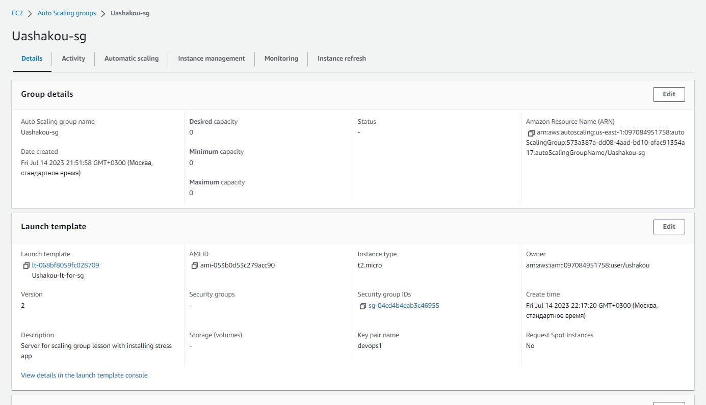
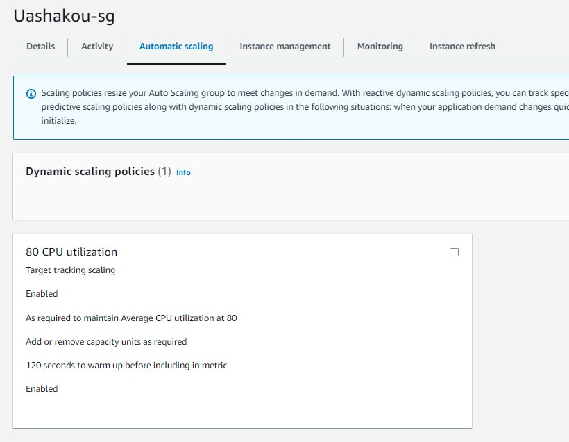
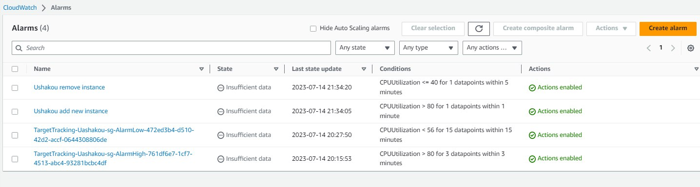
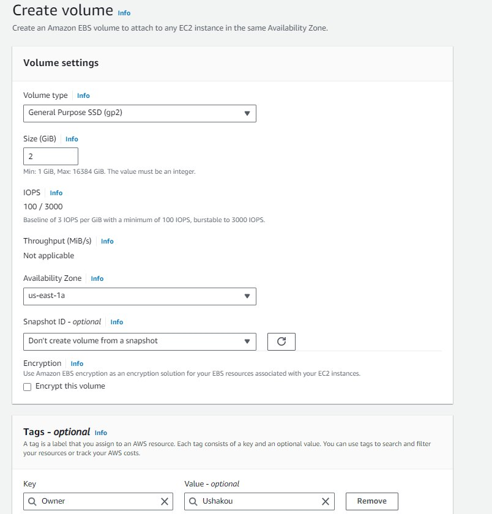

# IBA-DevOps-Practicum-HW
Each lesson's homework will be created in particular branch.

## 1. Set up autoscaling for the t2.micro server, if the CPU load on the server is more than 80%, then another instance should be raised.1. Set up autoscaling for the t2.micro server, if the CPU load on the server is more than 80%, then another instance should be raised.
> Настроить автоскейлинг для сервера t2.micro, если на сервере нагрузка на CPU больше 80% то должен подниматься еще один инстанс.Настроить автоскейлинг для сервера t2.micro, если на сервере нагрузка на CPU больше 80% то должен подниматься еще один инстанс.

- Create Launch template.
  
  
- with simple user-data.
  
  
- Create auto scaling group

  

- Configure Automatic scaling (2 variants)
  - **Target tracking scaling**
    
    

  - **Simple scaling**
    
    

    Configure CloudWatch

    

  
  
## 2. Create Linux EC2 t2.micro and attach second volume.2 to it. Create Linux EC2 t2.micro and attach a second volume to it.
> Создать Linux EC2 t2.micro и прикрепить к нему второй volume.2. Создать Linux EC2 t2.micro и прикрепить к нему второй volume.Создать Linux EC2 t2.micro и прикрепить к нему второй volume.2. Создать Linux EC2 t2.micro и прикрепить к нему второй volume.

It's too simple. 

