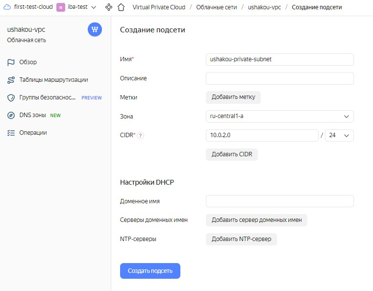

# IBA-DevOps-Practicum-HW

## 1.	Create a VPC and a network in it as shown in the figure.
> Создать VPC и сеть в ней как показано на рисунке. 

## 2.	Create two instances in Public subnet and Private subnet.
> Создать EC2 ubuntu t2.micro в Public subnet и Private subnet. 
## 3.	It should be possible to ssh into instance which is in the Private Subnet from the instance in Public Subnet.
> Должна быть возможность по ssh зайти на инстанс которая находится в Private Subnet из инстанса в Public Subnet.

# Yandex Cloud

## 1. Create a VPC and a network in it as shown in the figure.
- Create **VPC**.
  
  
- Create **two subnets** in the VPC.
  
  
  
  
  
## 2.	Create two instances in Public subnet and Private subnet.
- **Launch two instances** in different subnets.

  

  

## 3.	It should be possible to ssh into ec2 which is in the Private Subnet from the ec2 Public Subnet.
### `$ssh admiral@158.160.99.222`

### `admiral@test-public:~$ echo "$DEVOPS1-KEY" > ~/.ssh/id_rsa`

### `admiral@test-public:~$ chmod 600 ~/.ssh/id_rsa`

### `admiral@test-public:~$ ping -c 2 10.0.2.26`

PING 10.0.2.26 (10.0.2.26) 56(84) bytes of data.

64 bytes from 10.0.2.26: icmp_seq=1 ttl=63 time=1.10 ms

64 bytes from 10.0.2.26: icmp_seq=2 ttl=63 time=0.379 ms

--- 10.0.2.26 ping statistics ---

2 packets transmitted, 2 received, 0% packet loss, time 1001ms

rtt min/avg/max/mdev = 0.379/0.737/1.096/0.358 ms

### `admiral@test-public:~$ ping -c 2 google.com`

PING google.com (108.177.14.138) 56(84) bytes of data.

64 bytes from lt-in-f138.1e100.net (108.177.14.138): icmp_seq=1 ttl=61 time=21.0 ms

64 bytes from lt-in-f138.1e100.net (108.177.14.138): icmp_seq=2 ttl=61 time=19.7 ms

--- google.com ping statistics ---

2 packets transmitted, 2 received, 0% packet loss, time 1002ms

rtt min/avg/max/mdev = 19.727/20.367/21.007/0.640 ms

### `admiral@test-public:~$ ssh admiral@10.0.2.26`

Linux test-private1 5.10.0-19-amd64 #1 SMP Debian 5.10.149-2 (2022-10-21) x86_64

The programs included with the Debian GNU/Linux system are free software;
the exact distribution terms for each program are described in the
individual files in /usr/share/doc/*/copyright.

Debian GNU/Linux comes with ABSOLUTELY NO WARRANTY, to the extent
permitted by applicable law.

Last login: Fri Jul 21 09:20:47 2023 from 10.0.1.32

### `admiral@test-private1:~$ ping -c 2 10.0.1.32`

PING 10.0.1.32 (10.0.1.32) 56(84) bytes of data.

64 bytes from 10.0.1.32: icmp_seq=1 ttl=63 time=0.977 ms

64 bytes from 10.0.1.32: icmp_seq=2 ttl=63 time=0.324 ms

--- 10.0.1.32 ping statistics ---

2 packets transmitted, 2 received, 0% packet loss, time 1001ms

rtt min/avg/max/mdev = 0.324/0.650/0.977/0.326 ms

### `admiral@test-private1:~$ ping -c 2 google.com`

PING google.com (108.177.14.113) 56(84) bytes of data.

--- google.com ping statistics ---
2 packets transmitted, 0 received, 100% packet loss, time 1028ms

