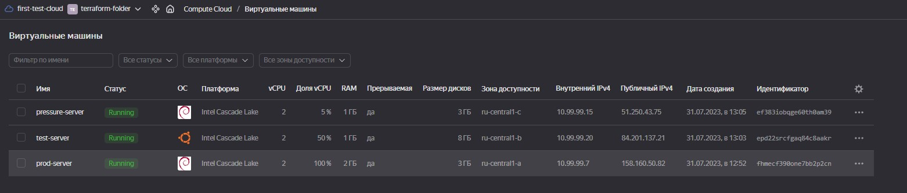

# IBA-DevOps-Practicum-HW

# Do with terraform.
## 1.	Using terraform, deploy two VPCs in two environments using workspaces.
> 1.	С помощью terraform развернуть два VPC в двух environment используя workspaces.
## 2.	Create an RDS and attach a password using random_password, the password must be stored in the parameter store.
> 2.	Создать RDS и прикрепить пароль с помощью random_password, пароль должен хранится в parameter store.


# 1.	Using terraform, deploy two VPCs in two environments using workspaces.

## The code is in folder **"1"**

> It is not good idea to use workspaces for making different environments. Usually people use it for making some tests. Imagine, that you want to test new OS in the prod environment. For this variant you use workspace **test**. If you want to test your environment uder pressure you use workspace **pressure**.

Each environment will be created with different AZ, instance types, tags and different prefixes in names.

***test.tfvar***

```
az = "ru-central1-b"

common_tags = {
  owner       = "ushakou"
  environment = "test"
}

vm_type = {
  cores         = 2
  memory        = 1
  core_fraction = 50
}

os_family_id = "ubuntu-2204-lts"

```

***pressure.tfvar***

```
az = "ru-central1-c"

common_tags = {
  owner       = "ushakou"
  environment = "pressure"
}

vm_type = {
  cores         = 2
  memory        = 1
  core_fraction = 5
}

```

`terraform init`

To create **prod** environment (our working environment):

`terraform apply`

To create **test** environment:

`terraform workspace new test`

`terraform apply -var-file test.tfvars`

To create **pressure** environment:

`terraform workspace new pressure`

`terraform apply -var-file pressure.tfvars`

Two additionals environments for tests will be created.




Don't forget to remove created environmnts for test.

`terraform workspace select pressure`

`terraform destroy`

`terraform workspace select test`

`terraform destroy`

`terraform workspace select default`

~~`terraform destroy`~~

## 2.	Create an RDS and attach a password using random_password, the password must be stored in the parameter store.

- Create random password.

```
resource "random_string" "rds_password" {
  length           = 12
  special          = true
  override_special = "!#$&"

  min_lower   = 1
  min_upper   = 1
  min_numeric = 1
  min_special = 1

  keepers = {
    kepeer = var.change_pass
  }
}
```
> Parameter **keepers** is for changing the password. Just change var.change_pass and new password will be generated.

- Store Password in Lockbox using generated password by random_string

```
resource "yandex_lockbox_secret" "secret" {
  name = "lesson14_secret"
}

resource "yandex_lockbox_secret_version" "db_key_version" {
  secret_id = yandex_lockbox_secret.secret.id
  entries {
    key        = var.db_key
    text_value = random_string.rds_password.result
  }
}
```

- Get data from Lockbox

```
data "yandex_lockbox_secret_version" "db_key_version" {
  secret_id  = yandex_lockbox_secret.secret.id
  version_id = yandex_lockbox_secret_version.db_key_version.id
}
```

- Now we can use this credentials in different services, for example in PostgreSQL DB.
  - Run DB-service

```
resource "yandex_mdb_postgresql_cluster" "pg_db" {
  name                = "pg_db"
  environment         = "PRODUCTION"
  network_id          = yandex_vpc_network.db_vpc.id
  security_group_ids  = [yandex_vpc_security_group.pgsql-sg.id]
  deletion_protection = false

  config {
    version = 15
    resources {
      resource_preset_id = "b2.medium"
      disk_type_id       = "network-ssd"
      disk_size          = "20"
    }
  }

  host {
    zone      = var.az
    name      = "db_pg-host"
    subnet_id = yandex_vpc_subnet.db_subnet.id
  }
}
```


-
  - Create user

```
resource "yandex_mdb_postgresql_user" "user1" {
  cluster_id = yandex_mdb_postgresql_cluster.pg_db.id
  name       = "user1"
  password   = data.yandex_lockbox_secret_version.db_key_version.entries[0].text_value
}
```


-
  -  Create DB and **use generated password**
```
resource "yandex_mdb_postgresql_database" "db1" {
  cluster_id = yandex_mdb_postgresql_cluster.pg_db.id
  name       = "db1"
  owner      = "user1"
  depends_on = [yandex_mdb_postgresql_user.user1]
}
```


