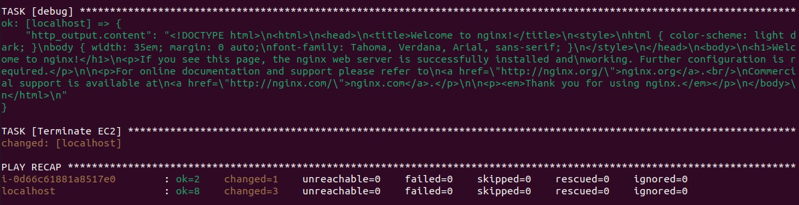

# IBA-DevOps-Practicum-HW

# Do with Ansible

## 1. Use one ansible playbook.
## - Create ec2 t2.micro using ansible playbook.
> Создать ес2 t2.micro с помощью ansible playbook.
## - Run a docker container there.
> Запустить там докер контейнер.
## - Remove the ec2
> Удалить этот инстанс.

## The result code was tested by Ansible-lint


### Install supporting AWS in python
```
pip install botocore boto3
```

### At the beginning we don't know ip of future ec2 instance, thats why we don't use hosts file.
Structure of playbook will be:
```
- hosts: localhost
  tasks:
    ... Creation ec2 instance with docker instance
- hosts: ec2_group
  tasks:
    ... starting nginx container
- hosts: localhost
  tasks:
    ... Checking and terminating ec2
```
### The first part (creation ec2) runs on localhost.

Name of instance we will declare in file **group_vars/all.yml**.

During creation ec2 we will use variable **user_data** to install docker engine and add ubuntu user to group docker:
```
user_data: |
  #!/bin/bash
  apt-get update -y
  apt-get install -y docker.io
  usermod -aG docker ubuntu
```
```
- name:  Create EC2
  amazon.aws.ec2_instance:
    name: "{{ ec2_name }}"
    key_name: "{{ ec2_key_pub }}"
    instance_type: "{{ instance_type }}"
    security_group: default
    network:
      assign_public_ip: true
    image_id: "{{ ec2_image }}"
    tags:
      Owner: Ushakou
    state: started
    wait: true
    wait_timeout: 120
    user_data: "{{ user_data }}"
  register: ec2
```
Here we've used **state: started** with timeout for waiting installation of docker engine and register variable **ec2** with all parameters of created instance.

Then we declare EC2 instance to **ec2_docker** group:
```
- name: Add EC2 instance to docker_hosts group
  ansible.builtin.add_host:
    name: "{{ ec2.instances[0].instance_id }}"
    groups: ec2_docker
    ansible_host: "{{ ec2.instances[0].public_ip_address }}"
    ansible_user: "{{ ec2_user }}"
    ansible_ssh_private_key_file: "{{ ec2_key_priv }}"
``` 
### The second part (running nginx container in ec2) runs on "ec2_docker" group
Here we run nginx container:
```
- name: Run Nginx container
  community.docker.docker_container:
    name: nginx_container
    image: "{{ docker_image }}"
    state: started
    ports:
      - "80:80" 
```
### The thirdt part (Check working container and terminate ec2) runs on localhost.
- We will check working by opening url **http://ip**.
```
- name: Check that nginx works
  ansible.builtin.uri:
    url: "http://{{ ec2.instances[0].public_ip_address }}"
    return_content: true
  register: http_output
 
- debug:
    var: http_output.content
```

- At the end we will terminate ec2 using its name.
```
  - name:  Terminate EC2
    amazon.aws.ec2_instance:
      name: "{{ ec2_name }}"
      state: terminated
```

### Result:



### playbook.yml
```
---
- name: Create EC2 with docker engine, run docker container and remove EC2 at the end
  hosts: localhost

  vars:
    ec2_image: ami-053b0d53c279acc90 # Ubuntu 22.04 LTS
    ec2_user: ubuntu
    ec2_key_pub: devops1
    ec2_key_priv: devops1.pem
    instance_type: t2.micro
    user_data: |
      #!/bin/bash
      apt-get update -y
      apt-get install -y docker.io
      usermod -aG docker ubuntu

  tasks:

    - name: Create EC2
      amazon.aws.ec2_instance:
        name: "{{ ec2_name }}"
        key_name: "{{ ec2_key_pub }}"
        instance_type: "{{ instance_type }}"
        security_group: default
        network:
          assign_public_ip: true
        image_id: "{{ ec2_image }}"
        tags:
          Owner: Ushakou
        state: started
        wait: true
        wait_timeout: 120
        user_data: "{{ user_data }}"
      register: ec2

    - name: Show external IP
      ansible.builtin.debug:
        var: ec2.instances[0].public_ip_address

    - name: Add EC2 instance to docker_hosts group
      ansible.builtin.add_host:
        name: "{{ ec2.instances[0].instance_id }}"
        groups: ec2_docker
        ansible_host: "{{ ec2.instances[0].public_ip_address }}"
        ansible_user: "{{ ec2_user }}"
        ansible_ssh_private_key_file: "{{ ec2_key_priv }}"

- name: Run nginx container in EC2
  hosts: ec2_docker
  tasks:

    - name: Run Nginx container
      community.docker.docker_container:
        name: nginx_container
        image: "{{ docker_image }}"
        state: started
        ports:
          - "80:80"

- name: Check working container and terminate EC2 at the end
  hosts: localhost
  tasks:

    - name: Check that nginx works
      ansible.builtin.uri:
        url: "http://{{ ec2.instances[0].public_ip_address }}"
        return_content: true
      register: http_output

    - name: Show opened html-page
      ansible.builtin.debug:
        var: http_output.content

    - name: Terminate EC2
      amazon.aws.ec2_instance:
        name: "{{ ec2_name }}"
        state: terminated

```
